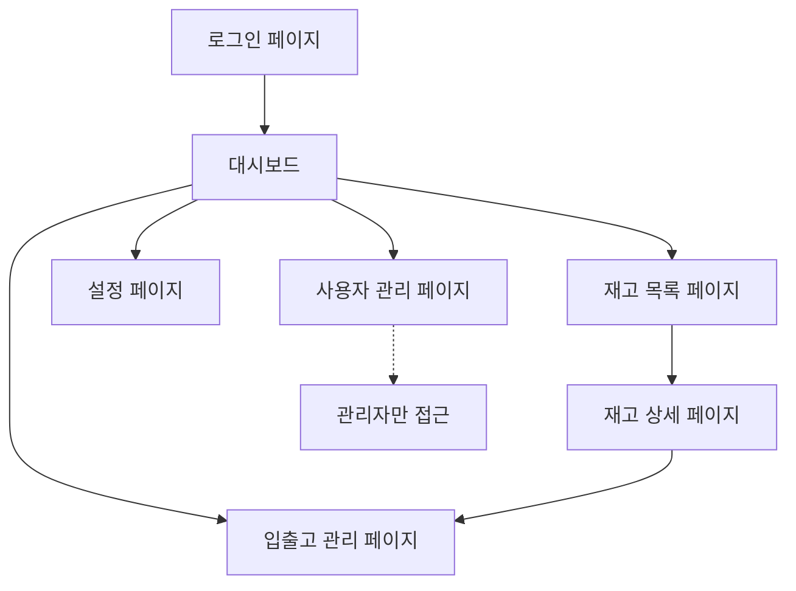

# 재고관리 시스템 요구사항 문서

## 1. Product Overview
웹 기반 재고관리 시스템으로 직원들이 효율적으로 재고를 추적하고 관리할 수 있는 플랫폼입니다.
- 중소기업의 재고 관리 문제를 해결하고, 직원들이 직관적인 웹 인터페이스를 통해 실시간으로 재고 현황을 파악할 수 있도록 지원합니다.
- 관리자 중심의 사용자 관리 시스템을 통해 보안성과 통제력을 확보하여 기업의 재고 관리 효율성을 극대화합니다.

## 2. Core Features

### 2.1 User Roles
| Role | Registration Method | Core Permissions |
|------|---------------------|------------------|
| Admin | 시스템 초기 설정 | 모든 기능 접근, 사용자 계정 생성/수정/삭제, 시스템 설정 관리 |
| Employee | 관리자가 계정 생성 | 재고 조회, 재고 입출고 기록, 재고 검색, 개인 프로필 수정 |

### 2.2 Feature Module
재고관리 시스템은 다음과 같은 주요 페이지들로 구성됩니다:
1. **로그인 페이지**: 사용자 인증, 로그인 폼
2. **대시보드**: 재고 현황 요약, 최근 활동, 알림 센터
3. **재고 목록 페이지**: 전체 재고 조회, 검색 및 필터링, 재고 상태 표시
4. **재고 상세 페이지**: 개별 재고 정보, 입출고 이력, 재고 수정
5. **입출고 관리 페이지**: 입고/출고 등록, 입출고 이력 조회
6. **사용자 관리 페이지**: 직원 계정 관리, 권한 설정 (관리자 전용)
7. **설정 페이지**: 시스템 설정, 개인 프로필 관리

### 2.3 Page Details
| Page Name | Module Name | Feature description |
|-----------|-------------|---------------------|
| 로그인 페이지 | 인증 폼 | 사용자명/비밀번호 입력, 로그인 검증, 세션 관리 |
| 대시보드 | 현황 요약 | 총 재고 수량, 부족 재고 알림, 최근 입출고 활동 표시 |
| 대시보드 | 빠른 액션 | 빠른 재고 검색, 입출고 등록 바로가기 |
| 재고 목록 페이지 | 재고 테이블 | 재고 목록 표시, 페이지네이션, 정렬 기능 |
| 재고 목록 페이지 | 검색 및 필터 | 재고명/카테고리/상태별 검색, 고급 필터링 |
| 재고 상세 페이지 | 재고 정보 | 재고 상세 정보 표시, 재고 수정, 이미지 업로드 |
| 재고 상세 페이지 | 입출고 이력 | 해당 재고의 모든 입출고 기록, 날짜별 필터링 |
| 입출고 관리 페이지 | 입출고 등록 | 입고/출고 선택, 재고 선택, 수량 입력, 메모 작성 |
| 입출고 관리 페이지 | 이력 조회 | 전체 입출고 이력, 날짜/유형별 필터링, 엑셀 내보내기 |
| 사용자 관리 페이지 | 계정 관리 | 직원 계정 생성/수정/삭제, 비밀번호 재설정 |
| 사용자 관리 페이지 | 권한 설정 | 사용자별 권한 부여, 활성/비활성 상태 관리 |
| 설정 페이지 | 시스템 설정 | 회사 정보, 재고 카테고리 관리, 알림 설정 |
| 설정 페이지 | 프로필 관리 | 개인 정보 수정, 비밀번호 변경 |

## 3. Core Process

**관리자 플로우:**
관리자는 시스템에 로그인 후 대시보드에서 전체 재고 현황을 확인하고, 필요시 사용자 관리 페이지에서 직원 계정을 생성하거나 관리합니다. 재고 관리 업무는 일반 직원과 동일하게 수행할 수 있습니다.

**일반 직원 플로우:**
직원은 관리자가 생성한 계정으로 로그인하여 대시보드에서 재고 현황을 확인합니다. 재고 목록에서 특정 재고를 검색하거나 필터링하여 찾고, 재고 상세 페이지에서 정보를 확인하거나 수정합니다. 입출고가 발생하면 입출고 관리 페이지에서 해당 내역을 등록하고 이력을 관리합니다.

## 4. User Interface Design

### 4.1 Design Style
- **Primary Color**: #2563eb (파란색), **Secondary Color**: #64748b (회색)
- **Button Style**: 둥근 모서리(border-radius: 8px), 그림자 효과가 있는 모던한 스타일
- **Font**: 'Noto Sans KR' 16px (본문), 'Noto Sans KR' 24px (제목)
- **Layout Style**: 카드 기반 레이아웃, 좌측 사이드바 네비게이션
- **Icon Style**: Heroicons 또는 Lucide 아이콘 세트 사용, 미니멀한 라인 스타일

### 4.2 Page Design Overview
| Page Name | Module Name | UI Elements |
|-----------|-------------|-------------|
| 로그인 페이지 | 인증 폼 | 중앙 정렬 카드, 그라데이션 배경, 입력 필드는 outline 스타일 |
| 대시보드 | 현황 요약 | 4개 컬럼 그리드 카드 레이아웃, 차트는 Chart.js 사용, 파스텔 컬러 |
| 재고 목록 페이지 | 재고 테이블 | 스트라이프 테이블, 호버 효과, 상태별 컬러 뱃지 (녹색/빨간색/노란색) |
| 재고 상세 페이지 | 재고 정보 | 2컬럼 레이아웃, 좌측 이미지/우측 정보, 탭 네비게이션 |
| 입출고 관리 페이지 | 입출고 등록 | 모달 팝업 폼, 드롭다운 선택기, 숫자 입력 스피너 |
| 사용자 관리 페이지 | 계정 관리 | 테이블 + 우측 패널 상세 정보, 토글 스위치로 활성/비활성 |

### 4.3 Responsiveness
데스크톱 우선 설계이지만 태블릿과 모바일에서도 사용 가능하도록 반응형 디자인을 적용합니다. 모바일에서는 사이드바가 햄버거 메뉴로 변경되고, 테이블은 카드 형태로 변환됩니다.