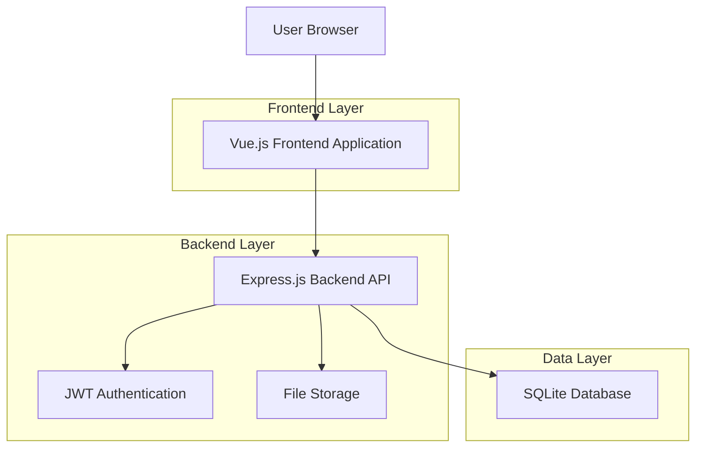
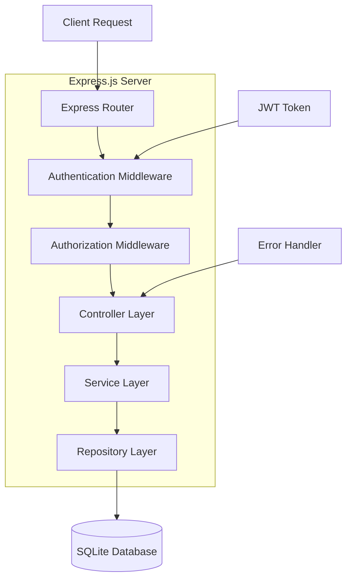
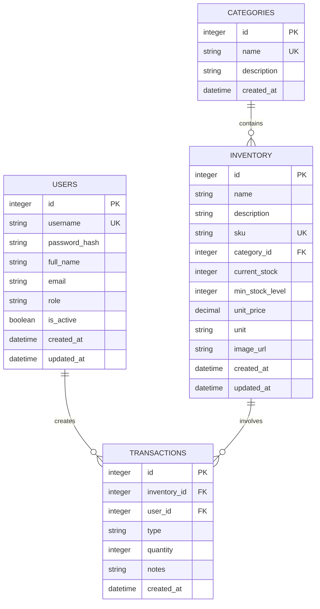

# 재고관리 시스템 기술 아키텍처 문서

## 1. Architecture design



## 2. Technology Description

* **Frontend**: Vue.js\@3 + TypeScript + Vite + Tailwind CSS + Pinia

* **Backend**: Express.js\@4 + TypeScript + JWT + bcrypt

* **Database**: SQLite3 + better-sqlite3

* **Development**: ESLint + Prettier + Husky

## 3. Route definitions

| Route          | Purpose                       |
| -------------- | ----------------------------- |
| /login         | 로그인 페이지, 사용자 인증 처리            |
| /dashboard     | 대시보드, 재고 현황 요약 및 빠른 액션        |
| /inventory     | 재고 목록 페이지, 전체 재고 조회 및 검색      |
| /inventory/:id | 재고 상세 페이지, 개별 재고 정보 및 이력      |
| /transactions  | 입출고 관리 페이지, 입출고 등록 및 이력 조회    |
| /users         | 사용자 관리 페이지, 직원 계정 관리 (관리자 전용) |
| /settings      | 설정 페이지, 시스템 설정 및 프로필 관리       |

## 4. API definitions

### 4.1 Core API

**사용자 인증 관련**

```
POST /api/auth/login
```

Request:

| Param Name | Param Type | isRequired | Description |
| ---------- | ---------- | ---------- | ----------- |
| username   | string     | true       | 사용자명        |
| password   | string     | true       | 비밀번호 (평문)   |

Response:

| Param Name | Param Type | Description |
| ---------- | ---------- | ----------- |
| success    | boolean    | 로그인 성공 여부   |
| token      | string     | JWT 토큰      |
| user       | object     | 사용자 정보      |

Example:

```json
{
  "username": "admin",
  "password": "password123"
}
```

**재고 관리 관련**

```
GET /api/inventory
GET /api/inventory/:id
POST /api/inventory
PUT /api/inventory/:id
DELETE /api/inventory/:id
```

**입출고 관리 관련**

```
GET /api/transactions
POST /api/transactions
GET /api/transactions/inventory/:id
```

**사용자 관리 관련 (관리자 전용)**

```
GET /api/users
POST /api/users
PUT /api/users/:id
DELETE /api/users/:id
```

## 5. Server architecture diagram



## 6. Data model

### 6.1 Data model definition



### 6.2 Data Definition Language

**사용자 테이블 (users)**

```sql
-- 사용자 테이블 생성
CREATE TABLE users (
    id INTEGER PRIMARY KEY AUTOINCREMENT,
    username VARCHAR(50) UNIQUE NOT NULL,
    password_hash VARCHAR(255) NOT NULL,
    full_name VARCHAR(100) NOT NULL,
    email VARCHAR(100),
    role VARCHAR(20) DEFAULT 'employee' CHECK (role IN ('admin', 'employee')),
    is_active BOOLEAN DEFAULT 1,
    created_at DATETIME DEFAULT CURRENT_TIMESTAMP,
    updated_at DATETIME DEFAULT CURRENT_TIMESTAMP
);

-- 인덱스 생성
CREATE INDEX idx_users_username ON users(username);
CREATE INDEX idx_users_role ON users(role);

-- 초기 관리자 계정 생성
INSERT INTO users (username, password_hash, full_name, role) 
VALUES ('admin', '$2b$10$hash_here', '시스템 관리자', 'admin');
```

**카테고리 테이블 (categories)**

```sql
-- 카테고리 테이블 생성
CREATE TABLE categories (
    id INTEGER PRIMARY KEY AUTOINCREMENT,
    name VARCHAR(100) UNIQUE NOT NULL,
    description TEXT,
    created_at DATETIME DEFAULT CURRENT_TIMESTAMP
);

-- 기본 카테고리 데이터
INSERT INTO categories (name, description) VALUES 
('전자제품', '컴퓨터, 스마트폰 등 전자기기'),
('사무용품', '펜, 종이, 파일 등 사무용품'),
('기타', '기타 분류되지 않은 물품');
```

**재고 테이블 (inventory)**

```sql
-- 재고 테이블 생성
CREATE TABLE inventory (
    id INTEGER PRIMARY KEY AUTOINCREMENT,
    name VARCHAR(200) NOT NULL,
    description TEXT,
    sku VARCHAR(100) UNIQUE NOT NULL,
    category_id INTEGER,
    current_stock INTEGER DEFAULT 0,
    min_stock_level INTEGER DEFAULT 0,
    unit_price DECIMAL(10,2),
    unit VARCHAR(20) DEFAULT '개',
    image_url VARCHAR(500),
    created_at DATETIME DEFAULT CURRENT_TIMESTAMP,
    updated_at DATETIME DEFAULT CURRENT_TIMESTAMP,
    FOREIGN KEY (category_id) REFERENCES categories(id)
);

-- 인덱스 생성
CREATE INDEX idx_inventory_sku ON inventory(sku);
CREATE INDEX idx_inventory_category ON inventory(category_id);
CREATE INDEX idx_inventory_stock ON inventory(current_stock);
```

**입출고 거래 테이블 (transactions)**

```sql
-- 거래 테이블 생성
CREATE TABLE transactions (
    id INTEGER PRIMARY KEY AUTOINCREMENT,
    inventory_id INTEGER NOT NULL,
    user_id INTEGER NOT NULL,
    type VARCHAR(10) NOT NULL CHECK (type IN ('in', 'out')),
    quantity INTEGER NOT NULL,
    notes TEXT,
    created_at DATETIME DEFAULT CURRENT_TIMESTAMP,
    FOREIGN KEY (inventory_id) REFERENCES inventory(id),
    FOREIGN KEY (user_id) REFERENCES users(id)
);

-- 인덱스 생성
CREATE INDEX idx_transactions_inventory ON transactions(inventory_id);
CREATE INDEX idx_transactions_user ON transactions(user_id);
CREATE INDEX idx_transactions_type ON transactions(type);
CREATE INDEX idx_transactions_date ON transactions(created_at DESC);
```

**트리거 생성 (재고 자동 업데이트)**

```sql
-- 입출고 시 재고 자동 업데이트 트리거
CREATE TRIGGER update_inventory_stock 
AFTER INSERT ON transactions
BEGIN
    UPDATE inventory 
    SET current_stock = current_stock + 
        CASE 
            WHEN NEW.type = 'in' THEN NEW.quantity
            WHEN NEW.type = 'out' THEN -NEW.quantity
        END,
        updated_at = CURRENT_TIMESTAMP
    WHERE id = NEW.inventory_id;
END;
```

